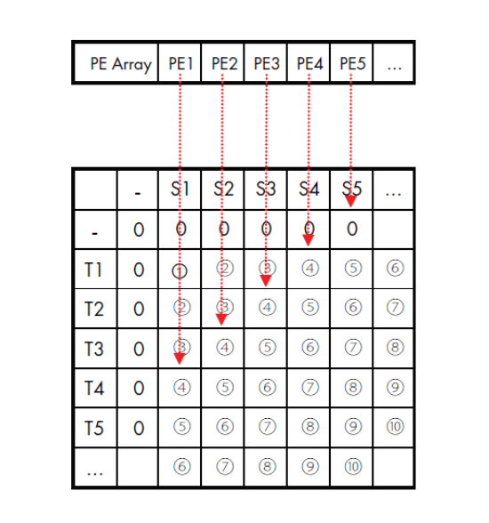
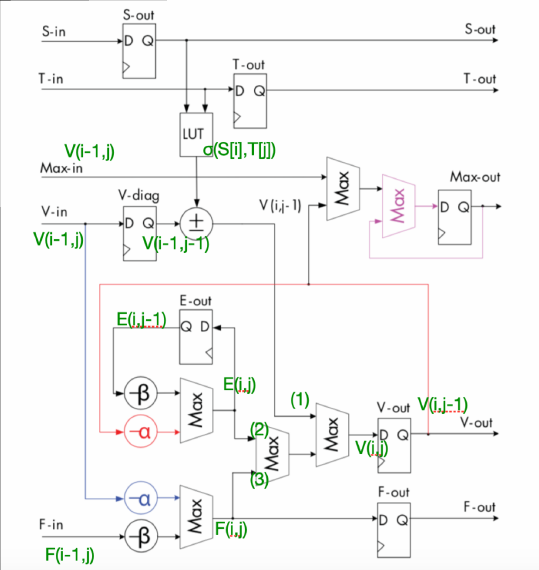

# Verilog_Project_2020Fall #
Special Project, 2020fall, NTUEE

## HW1 Counting the Number of Vertex Covers by Circle Graph ##
Design the circuit to count points in the circle. MUST finish RTL level Design and Synthesis using Design Vision

## HW2 Placement and Routing using Innovus ##
Transfer the gate level code of HW1 to transistor level using Innovus, a APR(Auto Place and Route) EDA tool.

## Final_Project Smith-Waterman Algorithm ##
Implement Smith-Waterman Algorithm using hardware. Introduction of Smith-Waterman Algorithm can be found in my another [repo](https://github.com/FlyingFrank515/SmithWaterman_algorithm)
Due to the capability of parallel accessing, using hardware can reduct the time complexity from O(mn) to O(m+n), much faster than software implementation.

### Parallelization ###
Every node can be assigned value when it’s upper, left, upper left nodes have value. So we can access nodes from left-up to right-down using PE array.

### PE(Processing array) ###
Combine PEs to form PE array.

### not enough PE? ###
When the number of PEs is less than the length sequence, We have to design an **Internal Buffer** to record boundary value and run iteratively. 
